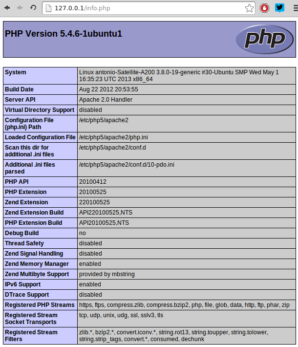
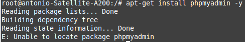
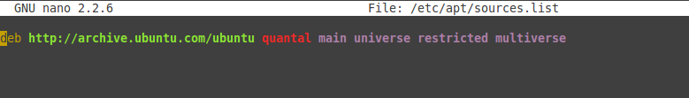
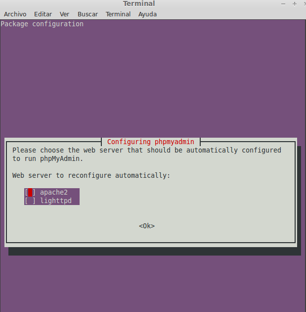
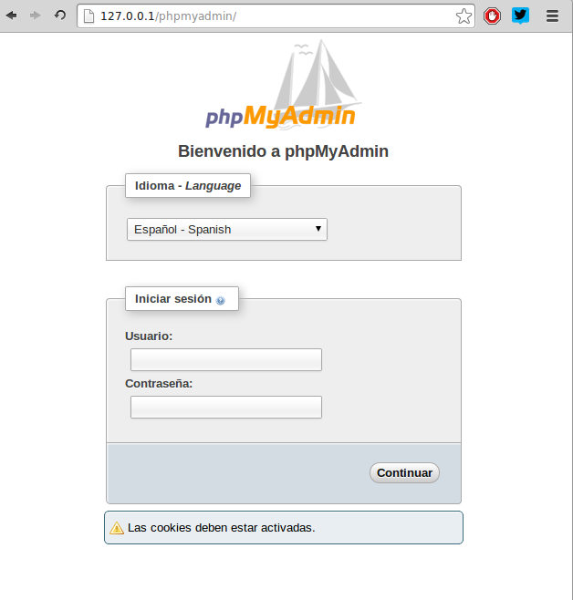

Práctica 2 IV
Copyright (C) 2013 Antonio Ángel Guirola Vicente
This program is free software: you can redistribute it and/or
modify
it under the terms of the GNU General Public License as published
by
the Free Software Foundation, either version 3 of the License, or
(at your option) any later version.
This program is distributed in the hope that it will be useful,
but WITHOUT ANY WARRANTY; without even the implied warranty of
MERCHANTABILITY or FITNESS FOR A PARTICULAR PURPOSE. See the
GNU General Public License for more details.
You should have received a copy of the GNU General Public License
along with this program. If not, see <http://www.gnu.
org/licenses/>.

Práctica 2 IV - Periódico digital en jaula chroot
=================================================

Práctica 2 de la asignatura IV

## Introducción

En esta práctica voy a crear una jaula con una distribución Ubuntu en la que voy a instalar el servidor web Apache así como lo necesario para ejecutar la aplicación de la [práctica 1](https://github.com/antonioguirola/periodico) (PHP, MySQL,...)

### Nota

He utilizado el mismo código que en la práctica uno, la cual se basa en otra práctica de una asignatura anterior para uso privado en la que no se tuvieron en cuenta las licencias, con esto quiero decir que aparecen imágenes tomadas de la web sin hacer referencia a su autor. Por cuestiones de tiempo no he podido cambiar esas imágenes por otras libres o debidadmente referenciadas.

## Creación de la jaula

Tras la instalación de *debootstrap* he creado una jaula con una distribución Ubuntu sobre la que desarrollaré la práctica:

```sh
sudo debootstrap --arch=amd64 quantal /jaulas/quantal/	http://archive.ubuntu.com/ubuntu
sudo apt-get install dchroot
sudo mkdir /var/chroot  
sudo chroot /var/chroot 
sudo nano /etc/schroot/schroot.conf
```

Hay que añadir lo siguiente al final de ese archivo:

```sh
[Ubuntu P2IV]
description=Ubuntu
location=/jaulas/quantal
priority=3
users=antonio
groups=sbuild
root-groups=root
```

El siguiente paso es configurar el directorio */proc*:

```sh
sudo mount -o bind /proc jaulas/quantal/proc/
sudo cp /etc/resolv.conf /jaulas/quantal/etc/resolv.conf
```

De esta forma ya podemos acceder a la jaula mediante `sudo chroot /jaulas/quantal` y ejecutar aplicaciones así como instalar las necesarias.

## Configuración de la jaula

El primer paso es instalar dentro de la jaula el servidor web y los entornos de ejecución necesarios para la aplicación, me he ayudado de [éste tutorial.](http://soportetecnicocurc.blogspot.com.es/2013/03/instalar-apache-php-mysql-y-phpmyadmin.html). Las órdenes son las siguientes:

```sh
apt-get install nano
apt-get install apache2 -y
apt-get install php5 libapache2-mod-php5 -y
service apache2 restart
```

A continuación compruebo que se están instalando las cosas correctamente, creo un archivo `nano /var/www/info.php` con el contenido: `<?php phpinfo();?>` y compruebo en el navegador que funciona:



Los siguiente es instalar MySQL y phpMyAdmin:

```sh
apt-get install mysql-server mysql-client -y
apt-get install php5-mysql php5-curl -y
service apache2 restart
apt-get install phpmyadmin
```

Con esa última orden aparecía el siguiente problema:



Leí [aquí](http://ubuntuforums.org/showthread.php?t=1799973) que es necesario activar el repositorio *universe*, [aquí](http://askubuntu.com/questions/148638/how-do-i-enable-the-universe-repository) encontré cómo añadirlo,el archivo */etc/apt/sources.list* debe acabar así:



Y ya sí se puede continuar con la instalación:

```sh
apt-get update
apt-get install phpmyadmin -y
```

Vemos que nos pregunta con qué servidor web lo queremos conectar:


Después de ésto, al introducir la dirección *http://127.0.0.1/phpmyadmin* en el navegador obtenía un error 404, por lo que seguí las instrucciones del manual e introduje las siguientes líneas al final del archivo `/etc/apache2/apache2.conf`:

```sh
#Include de phpmyadmin
Include /etc/phpmyadmin/apache.conf
```

Y ahora sí, tras reiniciar el servidor web:




 


